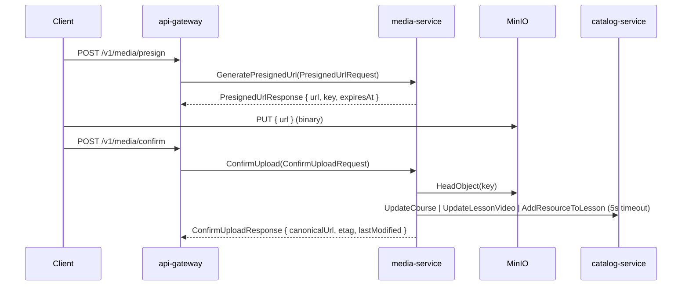

# maestria-grpc-contracts

Single source of truth for the gRPC contracts shared by every microservice in the
platform. The `.proto` files in this repository define the wire format and the
TypeScript mirror (`index.ts`) is the import surface consumed by the gateway and
each service.

## Contents

| File | Owner service | Notes |
|------|---------------|-------|
| `user.proto` | `maestria-user-service` | Profile and explicit role overrides |
| `catalog.proto` | `maestria-catalog-service` | Courses, modules, lessons, resources |
| `media.proto` | `maestria-media-service` | D2 presigned upload flow |
| `enrollment.proto` | `maestria-enrollment-service` | Enrollments and lesson progress |
| `sales.proto` | `maestria-sales-service` | Simulated payment processing |
| `review.proto` | (planned) | Course reviews; service not yet implemented |
| `index.ts` | — | Hand-mirrored TypeScript surface; must stay in sync with the `.proto` files |

## Media contract (D2 presigned uploads)

`media.proto` defines the `MediaService` exposed by `maestria-media-service`.
The D2 change replaces the previous `GeneratePresignedUrl` / `ConfirmVideoUpload`
RPCs with a presign + confirm flow that lets the browser PUT directly to MinIO.



### Enum: `FileType`

| Value | Number | Meaning |
|-------|--------|---------|
| `FILE_TYPE_UNSPECIFIED` | `0` | Proto3 zero; treated as invalid by server and client |
| `FILE_TYPE_COVER` | `1` | Course cover image |
| `FILE_TYPE_VIDEO` | `2` | Lesson video (≤5 GB) |
| `FILE_TYPE_RESOURCE` | `3` | Lesson downloadable resource (≤100 MB) |

### `PresignedUrlRequest` → `PresignedUrlResponse`

| Field | Type | Notes |
|-------|------|-------|
| `file_type` | `FileType` | Drives the per-type size cap (5 MB / 5 GB / 100 MB) |
| `owner_id` | `string` | Sanitized to prevent path traversal; prefix of the returned key |
| `size_bytes` | `int64` | Bound to the presigned URL signature |
| `content_type` | `string` | MIME; bound to the presigned URL signature |

Response carries `url` (presigned PUT, 900 s expiry), `key`, and `expires_at`.

### `ConfirmUploadRequest` → `ConfirmUploadResponse`

| Field | Type | Notes |
|-------|------|-------|
| `key` | `string` | The key returned by the presign step |
| `owner_id` | `string` | Must match the key's owner prefix (`PERMISSION_DENIED` otherwise) |
| `file_type` | `FileType` | Drives catalog fan-out (`UpdateCourse` / `UpdateLessonVideo` / `AddResourceToLesson`) |
| `size_bytes` | `int64` | Verified against `HeadObject.ContentLength` |

Response carries `canonical_url`, `etag`, and `last_modified`. Catalog errors
(timeout, NOT_FOUND, network) are logged but never surfaced to the client —
the object existing in MinIO is the source of truth.

## Contract check

`npm run check:proto` runs the contract check in `scripts/check-proto.ts` and
fails (exit 1) if `media.proto` and `index.ts` disagree on the public surface.
A `.github/workflows/check-proto.yml` job runs the same check on every PR that
touches `*.proto`, `index.ts`, or this repo's package manifest.

Run it locally before opening a PR:

```bash
npm install
npm run check:proto
```

## Regenerating the TypeScript mirror

`index.ts` is currently hand-edited. A `protoc`-driven regeneration is tracked
as a follow-up. Until then, keep the mirror in sync manually when you change
`.proto` field names or message shapes — the contract check will catch drift.

## Field number discipline

Field numbers in any message MUST NOT be reused. If you remove a field, comment
out its line in the proto (e.g. `// reserved 4;`) and use a fresh number for
the new field. The contract check does not currently assert reserved numbers,
but reviewers should reject PRs that reuse a removed number.
